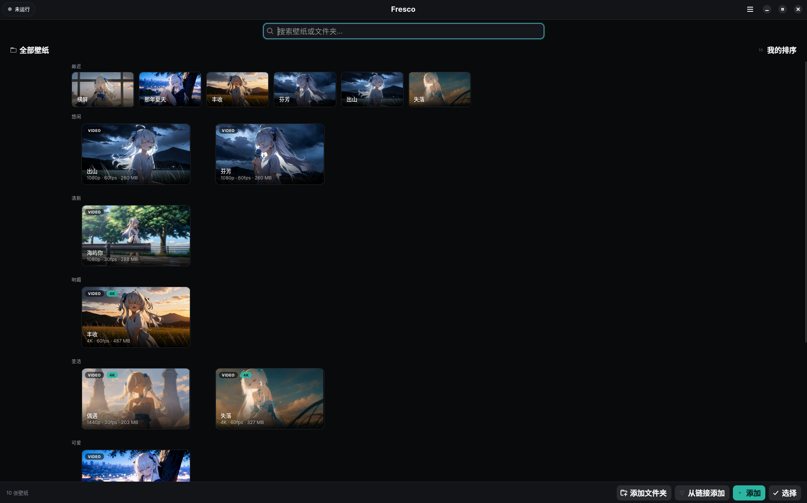

<div align="center">


# Fresco — Linux 动态壁纸

[English](README.md) | 简体中文

**Fresco** 是一款**免费、开源**的 Linux 动态壁纸应用，可将任意视频、GIF 或图片设为动态桌面壁纸，同时支持 **X11** 与 **Wayland** 显示服务器协议。它是 **Linux 平台上 Wallpaper Engine 的替代品**，可在 COSMIC、Hyprland、Sway、KDE Plasma 6 及 Deepin DDE 等桌面环境上运行。

[](https://github.com/DibbayajyotiRoy/fresco/releases/latest)
[](LICENSE)
[](https://github.com/DibbayajyotiRoy/fresco/actions/workflows/publish.yml)
[](https://github.com/DibbayajyotiRoy/fresco/stargazers)

**已有 110+ 个国家/地区的 1,500+ 人在使用。**

[官网](https://fresco.dibbayajyoti.com) · [安装](#安装) · [支持的环境](#支持的环境) · [对比](#fresco-与其他动态壁纸方案的对比) · [常见问题](#常见问题) · [更新日志](CHANGELOG.md) · [问题反馈](https://github.com/DibbayajyotiRoy/fresco/issues)



</div>

## 目录

- [Fresco 是什么？](#fresco-是什么)
- [速览](#速览)
- [安装](#安装)
- [如何在 Linux 上把视频设为壁纸](#如何在-linux-上把视频设为壁纸)
- [功能特性](#功能特性)
- [支持的环境](#支持的环境)
- [Fresco 与其他动态壁纸方案的对比](#fresco-与其他动态壁纸方案的对比)
- [性能与续航](#性能与续航)
- [常见问题](#常见问题)
- [隐私与使用条款](#隐私与使用条款)

## Fresco 是什么？

Fresco 是一款免费、开源的 Linux 动态壁纸应用，可将任意视频、GIF 或图片设为动态桌面壁纸，同时支持 X11 与 Wayland 显示服务器协议。通过 GTK4 图形界面即可将视频、GIF、图片、幻灯片和视频播放列表设为动态桌面壁纸——无需终端。播放经 mpv（VA-API / NVDEC）硬件加速，解码在 GPU 上进行，因此 CPU 占用保持在接近空闲的水平——实际功耗见[性能](#性能与续航)。它以 `.deb` 包形式安装，并在登录时自动恢复壁纸设置。

## 速览

| | |
|---|---|
| **软件简介** | Linux 桌面的动态/视频壁纸应用 |
| **支持平台** | X11 与 Wayland layer-shell（COSMIC、Hyprland、Sway、KDE Plasma 6、Deepin DDE） |
| **支持发行版** | Ubuntu、Pop!_OS、Linux Mint、Debian、elementary OS、Deepin 25、Kali Linux |
| **媒体格式** | mp4、webm、mkv、avi、mov、GIF、jpg/png/webp、幻灯片、视频播放列表 |
| **桌面挂件** | 同步歌词、时钟、音频可视化、专辑封面唱片——均绘制在壁纸内部，默认全部关闭 |
| **价格** | 免费——采用 GPL-3.0-or-later 许可证，无广告，无需注册账号 |
| **技术栈** | Rust、GTK4 / libadwaita、libmpv |
| **安装** | Deepin 应用商店、`.deb` 安装包或一行脚本命令 |
| **用户规模** | 来自 110+ 国家/地区的 1,500+ 名用户 |
| **语言** | 英文及 12 种翻译语言 |
| **最新版本** | 1.1.45 |

## 安装

**Deepin 25 — 应用商店：** 打开**应用商店**，搜索 **Fresco**，点击**安装**。Fresco 已上架 deepin 社区应用商店，无需手动下载，更新随商店推送。

**一行命令**（Debian、Ubuntu、Pop!_OS、Linux Mint、elementary OS、Deepin、Kali Linux）：

```bash
curl -fsSL https://github.com/DibbayajyotiRoy/fresco/releases/latest/download/install.sh | FRESCO_SOURCE=github bash
```

**手动安装：** 从 [Releases](https://github.com/DibbayajyotiRoy/fresco/releases/latest) 下载 `.deb` 并执行：

```bash
sudo apt install ./fresco_*.deb
```

**从源码构建：** 见 [docs/INSTALL.md](docs/INSTALL.md)。

## 如何在 Linux 上把视频设为壁纸

1. 安装 Fresco（见上），从应用启动器打开；
2. 点击**添加**，选择一个视频、GIF 或图片——或用**从链接添加**粘贴链接；
3. 可选：在编辑器中裁剪或旋转；
4. 点击**设为壁纸**，然后关闭应用。

窗口关闭后壁纸继续播放，登录时自动恢复播放。

## 功能特性

- **任意媒体**——循环视频（mp4/webm/mkv）、动态 GIF、静态图片、图片幻灯片、多视频播放列表
- **从链接添加**——粘贴 Pinterest 图钉链接或任意视频/图片的直接 URL；Fresco 会自动下载并打开裁剪编辑器
- **硬件解码**——通过 GPU 进行视频解码（VA-API / NVDEC），将解码工作转移到视频引擎上，让 CPU 占用率接近空闲水平。实测显示这种方式成本明显更低（但并非零开销——详见[性能](#性能与续航)部分）
- **省电模式**——为笔记本提供更低的 GPU 缩放开销；实测可将 GPU 功耗降低约一半（见[性能](#性能与续航)）
- **多显示器**——每块屏幕可设不同壁纸，同一视频可跨屏同步播放
- **昼夜壁纸**——按定时、任意时间段或日出/日落切换壁纸
- **桌面挂件**——同步歌词、主题时钟、音频可视化、旋转的专辑封面圆盘，直接绘制在壁纸内部，不会悬浮在你的窗口之上；默认全部关闭（见 [可以在 Linux 桌面上显示歌词吗](#可以在-linux-桌面上显示歌词吗)）
- **锁屏**——在你的真实锁屏上显示壁纸和挂件（时钟、问候语、正在播放、电池等），替代系统默认锁屏——COSMIC 1.9+ 与 KDE Plasma 6 支持动态视频与挂件，Sway/Hyprland/niri 与 X11 通过 `fresco lock` 显示壁纸与挂件，其他环境显示静帧。默认关闭，且 Fresco 永远看不到你的密码——见 [docs/LOCKSCREEN.md](docs/LOCKSCREEN.md)
- **批量管理**——一次选中多张壁纸，一键移除
- **内置目录**——在应用内浏览精选的、授权合规的壁纸
- **命令面板**——Ctrl+K 唤出面板，用键盘设定任意壁纸或使用任意功能
- **全屏自动暂停**——按显示器生效，COSMIC 上同样支持；另有电池供电时暂停
- **浏览器新标签页扩展**——在每个新标签页镜像你的壁纸（Chrome/Brave/Edge/Firefox；从 [`./extension`](extension) 以未打包方式加载）
- **Deepin DDE 支持**——在 Deepin 25 上自动适配 DDE 桌面，需要时点击桌面即可让图标重新显示十秒（见 [Deepin 上播放动态壁纸时桌面图标被隐藏了](#deepin-上播放动态壁纸时桌面图标被隐藏了)）
- **裁剪与旋转编辑器**——每张壁纸独立的音频/音量、幻灯片切换效果、可搜索的壁纸库

## 支持的环境

| 环境 | 动态壁纸 | 说明 |
|---|---|---|
| X11（GNOME、Cinnamon、XFCE 等） | ✅ | 内嵌渲染器。GNOME 仅在发行版仍提供 Xorg 会话时可用（见下方 GNOME 说明） |
| Kali Linux（Xfce，X11） | ✅ | 在 Kali 默认的 Xfce-on-X11 会话上运行，与其他 X11 桌面使用同一内嵌渲染器 |
| MATE（X11） | ✅ | 桌面图标在壁纸之上保持可见、可点击 |
| Deepin 25（DDE，X11） | ✅ | 自动 DDE 适配——社区已在 Deepin 25 Community build1 上验证 |
| COSMIC（Wayland） | ✅ | layer-shell |
| Hyprland | ✅ | layer-shell |
| Sway | ✅ | layer-shell |
| KDE Plasma 6（Wayland） | ✅ | layer-shell |
| GNOME on Wayland | ⚠️ | 仅静帧——Mutter 不提供动态壁纸绘制面，无视频、无挂件。动态视频需要一个 Fresco GNOME 扩展（规划中） |

以上每个环境都在每次发布时于 CI 中无头运行验证。

**GNOME 说明。** GNOME on Wayland 是唯一一个 Fresco 只能显示静帧的主流桌面。过去绕开的办法是登录 Xorg 会话，而这条路正在消失：GNOME 49 禁用了其 X11 会话，GNOME 50 移除了它，因此 Ubuntu 25.10 及更新版本（含 26.04 LTS）与 Fedora 43 及更新版本不再提供可切换的 Xorg 会话。Ubuntu 22.04 和 24.04 仍提供 "Ubuntu on Xorg"。在没有 Xorg 会话的系统上，原版 GNOME 桌面的动态视频只能等待规划中的 Fresco GNOME 扩展；Fresco 会在应用内如实说明，而不是假装视频在播放。KDE Plasma、COSMIC、Hyprland、Sway 以及所有 X11 桌面不受影响。

> “界面简洁易用——是为数不多对 Deepin 25 适配得当的动态壁纸应用，可通过 .deb 安装，硬件加速播放流畅。”
>
> — 柒玖（deepin 论坛）/ 柒仈玖（GitHub），测试环境：Deepin 25 Community build1，X11 会话，Intel Alder Lake-N [Intel Graphics]

Deepin 25 默认会话为 X11，Fresco 在该系统上即以此会话验证。Deepin 自家的 Wayland 合成器 [Treeland](https://github.com/linuxdeepin/treeland) 仍在开发中，Fresco 暂不对 Deepin on Wayland 作任何承诺。

## Fresco 与其他动态壁纸方案的对比

| | Fresco | Wallpaper Engine | Hidamari | Komorebi | mpvpaper | Variety |
|---|---|---|---|---|---|---|
| **动态视频壁纸** | ✅ | ✅ | ✅ | ✅ | ✅ | ❌ 仅静态图片 |
| **Wayland** | ✅ layer-shell | ❌ Windows 应用 | ⚠️ 仅 GNOME Wayland | — | ✅ layer-shell | — |
| **X11** | ✅ | 经 Proton（非官方） | ✅ | ✅ | ❌ | — |
| **图形界面（免终端）** | ✅ | ✅ | ✅ | ✅ | ❌ 命令行 | ✅ |
| **免费/开源** | ✅ GPL-3.0 | ❌ 付费、闭源 | ✅ GPL-3.0 | ✅ GPL-3.0 | ✅ GPL-3.0 | ✅ GPL-3.0 |
| **活跃维护** | ✅ | ✅ | ✅ | ⚠️ 低活跃 | ✅ | ⚠️ 维护模式 |

Fresco 将 `mpvpaper` 作为其 Wayland 渲染器打包，因此其是构建于该项目之上而非与其竞争。`—` 表示该项目自己的文档未明确说明支持与否。对比信息基于截至 2026 年 9 月这些项目的公开仓库。

## 性能与续航

柒玖（deepin 论坛）/ 柒仈玖（GitHub）在一台 Intel N150 上（Deepin 25，VA-API，每档各测两次）用 `turbostat` 实测了播放视频壁纸时的封装功耗：

| 视频 | 省电档位 | GPU 功耗 | 封装总功耗 |
|---|---|---|---|
| 1080p 60fps | 完整画质 | 1.37 W | 6.00 W |
| 1080p 60fps | **较低**（默认） | **0.63 W**（−54%） | **4.03 W**（−33%） |
| 4K 60fps | 完整画质 | 2.77 W | 7.94 W |
| 4K 60fps | **较低**（默认） | **1.60 W**（−42%） | **5.95 W**（−25%） |
| 4K 60fps | 最低画质 | 0.99 W（−65%） | 4.97 W（−37%） |

省电档位降低的是每帧的 GPU 缩放开销。不掉帧、硬件解码不受影响，因此播放依旧流畅——代价是画面锐度，而非流畅度。默认档为“较低”；“最低画质”在使用 4K 片源值得选择。

**如何解读这些数字。** 硬件解码并不意味着动态壁纸零开销——它把工作从 CPU 移到了能效更高的视频引擎上，而不是让工作消失。单看“CPU 占用低”是个弱指标，因为与之对比的替代方案是软件解码，后者差得多；诚实的度量是整机功耗，这正是表格报告**封装总功耗**而不只是 GPU 功耗的原因。

对上表数据的两点保留，以免被过度解读：

- 它们是**壁纸播放时的封装总功耗**，不是壁纸本身的边际开销。同一台机器上没有录空载基线，因此这些数字与空闲桌面之间的差值在此无法确立。百分比只用于省电*档位*之间的互比，这才是它们有效的用途。
- 它们来自一台机器（Intel N150，Alder Lake-N，VA-API，Deepin 25，每档两次）。独立显卡、NVDEC 及其他驱动会有所不同。

动态壁纸的功耗必然高于静态壁纸。省电档位、全屏自动暂停和电池供电时暂停的存在是为了约束这份开销，而不是假装它为零。

## 常见问题

### Wallpaper Engine 在 Linux 上能用吗？

不能原生运行。Wallpaper Engine 是 Windows 应用；在 Linux 上只能通过 Steam Play/Proton 运行，这是非官方的，且并非在所有配置上都能工作。Fresco 是原生 Linux 替代品，以 `.deb` 安装，无需兼容层。

### 在 Ubuntu 上怎么把视频设为壁纸？

安装 Fresco，打开它，点**添加**，选好视频，点**设为壁纸**。视频即作为桌面背景播放，并在登录时恢复播放。Ubuntu 默认的 GNOME-on-Wayland 会话只能显示静帧。在 Ubuntu 22.04 和 24.04 上可登录 **Ubuntu on Xorg** 会话获得完整的动态播放；Ubuntu 25.10 及更新版本（含 26.04 LTS）不提供 Xorg 会话，在这些系统上，原版 GNOME 桌面的动态视频需要规划中的 Fresco GNOME 扩展。使用 KDE Plasma、Xfce 或 MATE 的 Ubuntu 衍生版不受影响。

### 动态壁纸很消耗 CPU 或电池吗？

CPU 方面，不会。电池方面，会消耗一些——动态壁纸永远不可能零开销。

Fresco 在 GPU 上解码视频（VA-API / NVDEC），CPU 占用保持接近空闲。这只是把开销转移到视频引擎，而不是消除它。实测 Intel N150 在默认省电档下，1080p 壁纸播放时 GPU 功耗 0.63 W、封装总功耗 4.03 W（如何解读见[性能](#性能与续航)，包括它*不能*说明什么）。全屏自动暂停与电池供电时暂停，就是为了在最要紧的时候把这份开销从你的电池上挡开。

### Fresco 支持 Wayland 吗？

支持，在实现了 layer-shell 协议的合成器上——COSMIC、Hyprland、Sway 与 KDE Plasma 6。GNOME on Wayland 是例外：Mutter 不提供壁纸绘制面，Fresco 在那里显示静帧并在应用内说明。X11 会话则完全支持。

### Fresco 是免费的吗？

是。Fresco 以 GPL-3.0-or-later 许可证免费开源。无广告、无账号、无付费档。

### Fresco 支持 GNOME 吗？

X11 上完全支持，包括完整的动态壁纸——视频、挂件，一切照常。在 **GNOME on Wayland** 上，Mutter 不为任何应用提供可绘制的壁纸面，Fresco 只能显示静帧，挂件也不可用。如果你的发行版仍提供 Xorg 会话（Ubuntu 22.04 和 24.04 提供），注销后选择 "GNOME on Xorg" 或 "Ubuntu on Xorg" 即可获得完整的动态播放。GNOME 49 禁用了该会话、GNOME 50 移除了它，因此 Ubuntu 25.10 及更新版本（含 26.04 LTS）与 Fedora 43 及更新版本没有 Xorg 会话：在这些系统上，GNOME 的动态视频需要规划中的 Fresco GNOME 扩展。`fresco doctor` 会告诉你属于哪种情况。

### Fresco 和 mpvpaper 有什么区别？

`mpvpaper` 是一个命令行 mpv 封装，把单个视频播为 Wayland layer-shell 背景——没有图形界面、没有壁纸库、不支持 X11。Fresco 是围绕它构建的 GTK4 桌面应用：壁纸库、裁剪/旋转编辑器、排程、多屏同步、桌面挂件，并支持 X11，全程无需终端。Fresco 将 `mpvpaper` 作为 Wayland 渲染器打包而非取代它——见[对比表](#fresco-与其他动态壁纸方案的对比)。

### 能在 Kali Linux 上用 Fresco 吗？

能。Kali Linux 基于 Debian，Fresco 的安装方式与 Debian/Ubuntu 相同——`.deb` 包或一行安装脚本（见[安装](#安装)）。Kali 默认的 Xfce on X11 桌面通过 Fresco 的内嵌 X11 渲染器获得支持。

### 每个显示器可以用不同的壁纸吗？

可以。Fresco 支持按显示器设置壁纸，且同一视频跨多屏使用时播放保持同步。

### 支持 GIF 和图片幻灯片吗？

支持——除视频文件外，还有动态 GIF、静态图片、带切换效果（虚化、淡入黑场再淡出、推进、缓慢平移缩放——Ken Burns）的图片幻灯片，以及多视频播放列表。

### 可以在 Linux 桌面上显示歌词吗？

可以。Fresco 把**逐时间同步的歌词**绘制到你的壁纸上，通过 MPRIS 跟随系统中正在播放的内容——浏览器、音乐应用、视频播放器皆可。提供四种预设（极简、卡拉OK、字幕、卡片）、九宫格位置、同步偏移滑块、可选的下一行暗显，以及可选的曲名与歌手。

歌词是四个挂件之一，全部**默认关闭**。从应用菜单（Ctrl+,）→ **高级…** 打开：

| 挂件 | 效果 |
|---|---|
| **歌词** | 与音乐同步的当前行 |
| **时钟** | 六种主题——数字、极简、数码管、层叠、文字与卡片（带表盘的半透明面板）。12/24 小时制，可选日期。秒数默认关闭，因为它带来 60 倍的重绘开销 |
| **音频可视化** | 五种样式——柱状、镜像、波形、圆点、环形——支持取色器、双色渐变或彩虹 |
| **专辑封面** | 当前曲目封面在旋转的唱片上；播放暂停时停止旋转 |

挂件通过 mpv 的 OSD 层绘制在壁纸内，而不是画在独立窗口里，因此永远不会盖在你的窗口上方、永远不会拦截点击，且在 X11 与所有 layer-shell 合成器上表现一致。实测在音乐播放、四个挂件全开时开销为**单核 CPU 的 0.8%**——几乎全部来自音频采集，因为内容不变就不重绘。

挂件默认出现在**每一块屏幕**上。想只留在一块屏上，可在 `config.toml` 的 `[widgets]` 块中加 `monitor = "DP-1"`（暂无图形界面开关）。挂件**在 GNOME on Wayland 上不可用**——那里没有可供 Fresco 绘制的动态壁纸面，壁纸在那里退回静帧也是同一原因。

### Linux 有类似 Conky 的桌面挂件吗？

有，而且 Fresco 提供的四个挂件不需要面板、不需要扩展、也不需要桌面环境配合：时钟、同步歌词、音频可视化与旋转的专辑封面圆盘。它们绘制在壁纸里而非窗口里，因此在不自带组件层的桌面上也能工作——包括 COSMIC、Hyprland 与 Sway。与 Conky 不同，Fresco **没有系统监控类挂件**（没有 CPU、内存、温度或网络读数），所以它与 Conky 是音乐与时计的互补关系，而非替代。唯一跑不了的地方是 GNOME on Wayland。

### 能在桌面背景上使音乐可视化吗？

能。Fresco 的音频可视化跟随系统正在播放的内容，共五种样式——柱状、镜像、波形、圆点或环形——支持取色器、双色渐变或彩虹。默认关闭，首次开启时会征求你的同意，因为它需要监听你的音频输出；该同意在加载配置时同样强制生效，所以手动改 `config.toml` 无法在背后悄悄打开它。可与专辑封面挂件搭配，得到旋转的当前曲目封面唱片。

### 哪些音乐播放器能配合歌词挂件？

任何发布标准 MPRIS 元数据的播放器都可以，但可靠性并不相同：

| 播放器 | 能用吗 | 说明 |
|---|---|---|
| **Firefox** | ✅ | 最可靠，本功能即针对它验证 |
| Chrome / Brave / Edge / Vivaldi / Opera | ⚠️ | 见下 |
| Spotify——**浏览器版** | ✅ | 正确上报播放位置 |
| Spotify——**Linux 原生客户端** | ⚠️ | 位置永远上报为 0，歌词无法保持同步 |
| 本地播放器（VLC、mpv、Rhythmbox 等） | ✅ | 也是最可能有本地 `.lrc` 文件的情形 |

Chromium 系浏览器在任意标签页开始播放媒体时就认领一个 MPRIS 名，**之后永不释放**——一个由来已久的 Chromium bug。播放结束后，标题被清空但总线上残留一个过期的“僵尸”会话，有时还带着封面。Fresco 忽略不发布曲名的播放器，从而跳过这些会话，但 Chromium 自身的上报仍然不够稳定，所以这一功能请用 Firefox。

Spotify 的 Linux 原生客户端自 2018 年起就返回 `Position: 0` 且从不发出 seek 事件，native 与 snap 包皆然。Fresco 通过行为特征检测这一情况——播放中三次间隔的零读数——转而从切歌时刻起让歌词时钟自由计时，这在你频繁跳转时会漂移。浏览器版 Spotify 没有这个问题。

### 歌词从哪里来？

优先用本地 `.lrc` 文件：与音频文件同目录的，或你在 Fresco 中指定的歌词目录里匹配的。这条路离线可用且匹配最佳，因为那是你自己选的文件。

没有本地文件时——如果你在线听歌，大多数时候如此——Fresco 到 [LRCLIB](https://lrclib.net)（免费、社区运营的同步歌词数据库）查询该曲目，并把结果缓存在 `~/.cache/fresco/lyrics`，同一首歌绝不重复抓取。该查询会把曲名、歌手与专辑发送给 LRCLIB；除非歌词挂件开启且曲目没有本地文件，否则什么都不会发送。Fresco 不托管、不持有、也不为歌词内容授权——LRCLIB 的条目由其用户贡献，LRCLIB 亦声明对这些内容不做授权，因此 Fresco 按需抓取并按用户缓存，而不自带歌词库。

`.lrc` 文件的时间轴是手工制作的，常常略有偏差。歌词设置里的同步偏移滑块就是为此准备的。

### 支持哪些 Linux 发行版？

Fresco 为 Debian 系与 Ubuntu 系发行版提供 `.deb` 包：Ubuntu、Pop!_OS、Linux Mint、Debian、elementary OS、Deepin 25 与 Kali Linux。其他发行版可从源码构建——见 [docs/INSTALL.md](docs/INSTALL.md)。

### 安装后 Fresco 没有出现在 Deepin 启动器里——为什么？

这是 dde-launchpad 的已知问题：它安装后的刷新抓不到 Fresco。运行 `killall dde-shell`（它会自动重启），或注销再登录，条目就会永久出现。Fresco 本身安装无误——Deepin 自家的应用管理器能列出它，其图标在所有已装主题中都能解析。该问题被记录在 [docs/AUDIT.md](docs/AUDIT.md#deepin-launcher-hot-refresh-open-2026-07-26)。如果在一台装过 Fresco 的机器上每次重装都遇到，可运行 `sh scripts/dde-launcher-diag.sh`——它是只读的，会输出一份值得附到 issue 里的日志。

### Deepin 上播放动态壁纸时桌面图标被隐藏了

Deepin 25 把壁纸和桌面图标画在同一个不透明窗口里，所以可见的动态壁纸只能叠在那个窗口之上——不存在介于两者之间的层。**点击桌面，图标会回来十秒**，足够打开你要的东西；之后壁纸恢复，再点一次再得十秒。要调整时长，可在 `~/.config/fresco/config.toml` 里设 `dde_icon_peek_secs`（`0` 表示壁纸永远置顶）。Fresco 关闭或暂停时，Deepin 自家壁纸照常显示。

### 崩溃后我的 MATE 桌面背景看起来发黑

为了让 Caja 的桌面图标保持在动态壁纸之上，Fresco 运行时会把 MATE 的桌面背景设为一个近黑色的关键色（`#010101`），并把所有不是该颜色的内容——即图标——拷贝到壁纸之上。你原来的背景会先被保存，在 Fresco 停止或被禁用时放回。如果 Fresco 在此之前崩溃，桌面就会保持黑色；**重新启动 Fresco 即可恢复你的背景**。在没有 Composite 与 Damage 扩展的 X 服务器上，Fresco 改为采用与 [Deepin](#deepin-上播放动态壁纸时桌面图标被隐藏了)相同的做法：隐藏图标，点击桌面找回。

### Wayland 上我的壁纸是黑的（NVIDIA、COSMIC、Hyprland、Sway）

壁纸全黑——其他一切正常、日志无错——几乎总意味着 Fresco 打包的 mpvpaper 渲染器对你的环境太旧。1.6 之前的版本在 NVIDIA 专有驱动上初始化 EGL、报告成功，然后永远不呈现任何帧。

先运行 `fresco doctor`。它会打印它选中的渲染器、该二进制的来源（打包内置还是你自己安装的）以及大致版本，并在版本早于修复时给出警告：

```
  ✓ mpvpaper available (/usr/lib/fresco/mpvpaper-libmpv2)
      source: bundled · version: 1.4–1.6
  ⚠ mpvpaper may be too old …
```

Fresco 已经会优先选用 `PATH` 上较新的 `mpvpaper` 而非较旧的内置版本，所以安装发行版的 `mpvpaper` 包（或用 `scripts/build-mpvpaper.sh` 构建[上游版本](https://github.com/GhostNaN/mpvpaper)）通常就够了。要让 Fresco 使用特定的二进制，把 **`FRESCO_MPVPAPER`** 设为它的完整路径——这会覆盖其他一切选择：

```bash
mkdir -p ~/.config/environment.d
echo 'FRESCO_MPVPAPER=/home/YOU/.local/bin/mpvpaper' > ~/.config/environment.d/fresco.conf
```

注销再登录（systemd 在会话启动时读取 `environment.d`），然后用 `fresco doctor` 确认 `source:` 一行已变为 `FRESCO_MPVPAPER override`。

类似地，**`FRESCO_HWDEC`** 可覆盖 mpv 的硬件解码器（如 `nvdec`、`nvdec-copy`、`vaapi`、`no`）——这是排查 CPU 占用高的诊断开关。默认情况下，检测到 NVIDIA GPU 时 Fresco 选 `nvdec,vaapi,auto-safe`，否则选 `auto-safe`（旋转视频走拷回：`nvdec-copy,auto-copy` / `auto-copy`）。

### 怎么一次移除多张壁纸？

点击底栏的**选择**（或右键一张壁纸选**选择…**），勾选要删的，点**移除**。**全选**遵循当前搜索，所以可以先搜索再整批清空。移除壁纸只是把它移出 Fresco 库——磁盘上的源文件保留。

## 隐私与使用条款

**在你同意之前，什么都不发送。** 首次启动时弹一次同意对话框，之后随时可在设置中更改。

无论选哪边，每天一次，Fresco 记录“有一个安装处于活跃状态”、所在国家与版本号。这是计数。对话框征求同意的是**细节**：

| 你的选择 | Fresco 发送的内容 |
| --- | --- |
| **全部接受** | 计数，外加发行版、桌面环境、会话类型、视频后端、显示器数量、你使用的功能、错误类型、城市与地区，以及每次签到的精确时间。 |
| **拒绝可选项** | 仅计数：一个随机安装 id（绝不从你的硬件或姓名派生）、国家、应用版本、打包方式。你的签到以**日期而非时间**存储。 |

**城市与精确使用时间是可选的**——只有全部接受才会发送，拒绝则绝不发送。任何层级都绝不收集坐标：地理定位端点会丢弃经纬度而不是返回它们。

这些数字用于决定发布前要测试哪些发行版和桌面环境，以及哪些地区的下载需要镜像。它们绝不出售、绝不共享、绝不用于广告，也没有任何分析服务商介入。

**无论选哪边都绝不收集：** 个人数据、文件名、你的壁纸、IP 地址、音频、按键或剪贴板内容。国家由 Cloudflare 在网络边缘从你的 IP 解析，所以本项目只会收到一个两字母代码。（你主动写下并按下发送的文字——一条反馈评论，或发给下文维护者的消息——是你选择发送的消息，不属于收集。）

要完全不发送任何东西，在 `~/.config/fresco/config.toml` 里设 `telemetry = false` 和 `telemetry_prompted = false`。

### 与维护者匿名交流

**菜单 → 给维护者留言** 会开启与 Fresco 维护者的一条私密双向对话。无需账号、无需邮箱、无需 GitHub 登录。它是双向匿名的：除了“维护者”你不会知道对方是谁，对方也不知道你是谁——只能看到你的消息，以及（如果你保留勾选）对话框中展示的配置摘要。

对话由一个随机凭据标识，与遥测分开生成、存在不同文件里，因此对话永远无法与使用画像关联。无论你全部接受还是拒绝可选项，它的行为完全一致。在你发出第一条消息之前，什么都不存在。

📄 **[完整使用条款与隐私政策 →](TERMS.md)**——每个字段，逐项列表，毫无遗漏。每一行发送数据的代码都在 [`src/telemetry.rs`](src/telemetry.rs) 里，你可以查证而不是选择相信。

## 贡献与反馈

欢迎 bug 报告、功能建议和 PR——开一个 [issue](https://github.com/DibbayajyotiRoy/fresco/issues)，或使用应用内的反馈对话框。

## 许可证

[GPL-3.0-or-later](LICENSE)——免费且开源。

---

<sub>Fresco——面向 Linux（X11 与 Wayland）的动态壁纸、视频壁纸与动画桌面背景，带有绘制进壁纸的桌面挂件：桌面歌词、桌面时钟挂件、音频可视化（音乐可视化壁纸）与专辑封面。可作为 Ubuntu、Pop!_OS、Linux Mint、Debian、elementary OS、Deepin 与 Kali Linux 的 Wallpaper Engine 替代品，也是 COSMIC 与 Wayland 上壁纸挂件的 Conky 替代品。已有 110+ 国家/地区的 1,500+ 人在使用。最后更新：2026-09-28。</sub>
